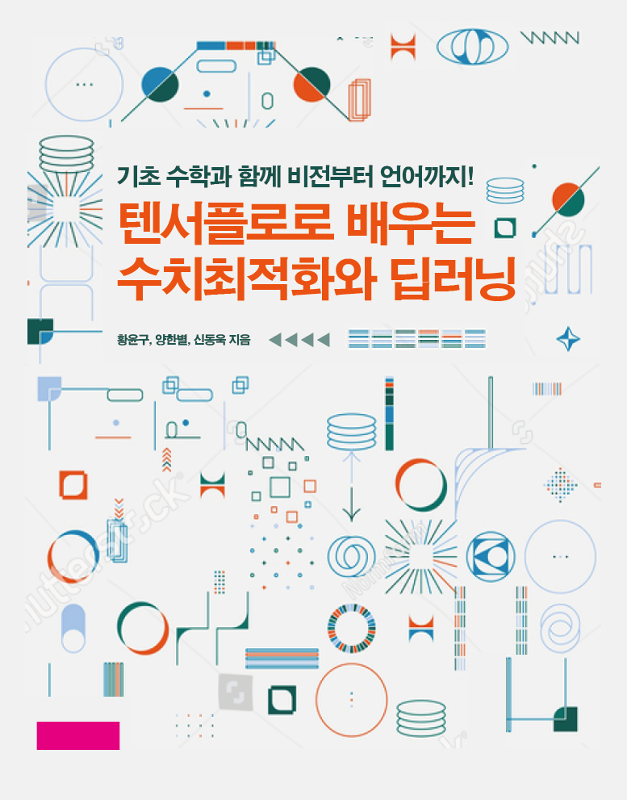

# 텐서플로로 배우는 수치최적화와 딥러닝

<table>
<tr>
    <td></td>
    <td>아래 목차의 링크를 이용하며 쉽게 소스코드를 볼 수 있습니다. 
       책에서 사용된 모든 이미지는 images폴더에 있습니다.
       궁금한 점은 Issue를 통해 문의하시면 최대한 빠른 시일에 답변해드립니다.
       혹시 있을 코드 오류나 오탈자 등도 Issue를 통해 알려주시면 수정하여 반영하겠습니다.
  </td>
</tr>
</table>

## 목차

1. 프로그래밍 준비 작업
1. [주피터 노트북과 파이썬 튜토리얼](https://colab.research.google.com/github/DNRY/tfopt/blob/main/notebooks/CH02.ipynb)
1. [텐서플로 튜토리얼](https://colab.research.google.com/github/DNRY/tfopt/blob/main/notebooks/CH03.ipynb)
1. [최적화 이론에 필요한 선형대수와 미분](https://colab.research.google.com/github/DNRY/tfopt/blob/main/notebooks/CH04.ipynb)
1. [딥러닝에 필요한 최적화 이론](https://colab.research.google.com/github/DNRY/tfopt/blob/main/notebooks/CH05.ipynb)
1. 고전 수치최적화 알고리즘
1. [딥러닝을 위한 수치최적화 알고리즘](https://colab.research.google.com/github/DNRY/tfopt/blob/main/notebooks/CH07.ipynb)
1. [선형 회귀 모델](https://colab.research.google.com/github/DNRY/tfopt/blob/main/notebooks/CH08.ipynb)
1. [선형 분류 모델](https://colab.research.google.com/github/DNRY/tfopt/blob/main/notebooks/CH09.ipynb)
1. [신경망 회귀 모델](https://colab.research.google.com/github/DNRY/tfopt/blob/main/notebooks/CH10.ipynb)
1. [신경망 분류 모델](https://colab.research.google.com/github/DNRY/tfopt/blob/main/notebooks/CH11.ipynb)
1. [언더피팅/오버피팅 소개](https://colab.research.google.com/github/DNRY/tfopt/blob/main/notebooks/CH12.ipynb)
1. [언더피팅의 진단과 해결책](https://colab.research.google.com/github/DNRY/tfopt/blob/main/notebooks/CH13.ipynb)
1. [오버피팅의 진단과 해결책](https://colab.research.google.com/github/DNRY/tfopt/blob/main/notebooks/CH14_Classification.ipynb)
    1. [Regression](https://colab.research.google.com/github/DNRY/tfopt/blob/main/notebooks/CH14_Regression.ipynb)
    1. [Classification](https://colab.research.google.com/github/DNRY/tfopt/blob/main/notebooks/CH14_Classification.ipynb)
1. [텐서보드(TensorBoard) 활용](https://colab.research.google.com/github/DNRY/tfopt/blob/main/notebooks/CH15.ipynb)
1. [모델 저장하기와 불러오기](https://colab.research.google.com/github/DNRY/tfopt/blob/main/notebooks/CH16.ipynb)
1. 딥러닝 가이드 라인
1. [CNN 모델](https://colab.research.google.com/github/DNRY/tfopt/blob/main/notebooks/CH18.ipynb)
1. [GAN(Generative Adversarial Networks) 모델](https://colab.research.google.com/github/DNRY/tfopt/blob/main/notebooks/CH19.ipynb)
1. [Transfer Learning](https://colab.research.google.com/github/DNRY/tfopt/blob/main/notebooks/CH20.ipynb)
1. 자연어 데이터 전처리와 머신러닝 모델
1. [IMDB 영화 리뷰 예제: RNN 모델 학습](https://colab.research.google.com/github/DNRY/tfopt/blob/main/notebooks/CH22.ipynb)
1. [IMDB 영화 리뷰 예제: RNN 사전학습 모델 활용](https://colab.research.google.com/github/DNRY/tfopt/blob/main/notebooks/CH23.ipynb)
1. [IMDB 영화 리뷰 예제: BERT 사전학습 모델 활용](https://colab.research.google.com/github/DNRY/tfopt/blob/main/notebooks/CH24.ipynb)
1. [혼합 타입 데이터를 입력으로 받는 딥러닝 모델](https://colab.research.google.com/github/DNRY/tfopt/blob/main/notebooks/CH25.ipynb)
1. [GPU 사용하기](https://colab.research.google.com/github/DNRY/tfopt/blob/main/notebooks/CH26.ipynb)
1. 텐서플로를 이용한 병렬 계산
